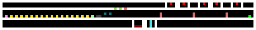
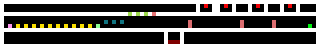

# kittygif

**kittygif converts levels between two tile-based platform games that share a
level format ancestry: *Robot Wants Kitty* (whose levels are `.kitty` files) and
*Robot Wants It All* (whose levels are GIF images, one pixel per tile).** It is a
Python package with a command-line tool, and it also runs in your browser.

It converts levels; it does not edit them. Its job is to let a level made for one
of these games be opened, inspected and played in the other. Each of the
[kittyengine](https://github.com/PeerInfinity/kittyengine) engine's four demo
levels was made with kittygif.

**▶ Try it in your browser: [peerinfinity.github.io/kittygif](https://peerinfinity.github.io/kittygif/).**
The page runs this same package inside the browser (under Pyodide), so nothing
is uploaded. Drop in a `.gif` or `.kitty` level, read the report and download the
converted file. Raw `.bin` maps need the command line, because a raw map does
not record its own width and height.

> **This project's code was written by AI (Claude), directed and reviewed by
> [PeerInfinity](https://github.com/PeerInfinity).** The file-format facts it
> relies on were worked out by reading the games' code: decompiled Flash
> bytecode, the C++ source and a disassembly of the program that reads the GIF
> levels. Each fact records where it came from in `src/kittygif/data/id-table.json`,
> and facts that could not be checked are marked as judgement calls. The checks
> described under [Tests](#tests) can all be re-run.

## Words used here

| word | meaning |
|------|---------|
| **RWK** | *Robot Wants Kitty*, by Raptisoft. Its levels are `.kitty` files. |
| **RWIA** | *Robot Wants It All*, a compilation by Hamumu Software. Its levels are GIF images. |
| **Flash version** | the original Flash build of *Robot Wants Kitty*. It has a single map, stored as raw bytes inside the game file. |
| **tile id** | the number stored in one cell of a level, saying what is there (air, rock, a door, an enemy). |
| **id table** | a JSON file listing every tile id on both sides and how each one converts. |
| **dialect** | which id table is used to read the GIF or raw side: `rwia` (the default) or `flash`. The two games use mostly the same numbers, but not all of them mean the same thing. |
| **container** | how the cells are stored on disk: a GIF image, raw bytes (`.bin`), or a `.kitty` file. The container and the dialect are chosen separately. |
| **tape** | a recording of which buttons were held on each tick of a run. Replaying a tape replays the run. |

## Install

```bash
pip install -e .              # the tool and the library
pip install -e ".[test]"      # also pytest, to run the tests
```

It needs Python 3.9 or newer, and Pillow.

## Converting levels

```bash
kittygif gif2kitty LEVEL.gif OUT.kitty                              # RWIA gif -> .kitty
kittygif raw2kitty MAP.bin OUT.kitty --width W --height H --dialect flash
kittygif kitty2gif LEVEL.kitty OUT.gif                              # .kitty -> RWIA gif
kittygif info FILE...                                               # list what a level contains
kittygif emit-json LEVEL.gif OUT_PREFIX                             # tile-map files for a viewer
```

Each conversion prints a summary to stderr of anything it could not carry
across. The main options:

| option | what it does |
|--------|--------------|
| `--dialect rwia\|flash` | which id table reads the GIF or raw cells (default `rwia`) |
| `--report PATH` | also write the conversion report as JSON (`-` for stdout). Only the three conversions write one. |
| `--quiet` | don't print the summary |
| `--name NAME` | the level name stored in the `.kitty` (default: the output file's name in capitals) |
| `--paint-style STYLE`, `--no-paint` | how the solid terrain is painted in the `.kitty`; a GIF has no paint, so a default style is used |
| `--emit-json PREFIX` | on a conversion, also write the viewer files for the converted level |
| `--id-table PATH` | use a different copy of the id table (overrides `--dialect`; so does the `KITTYGIF_ID_TABLE` environment variable) |
| `--palette PATH`, `--viewer-traits PATH` | use different copies of the other two data files |

`kittygif --help` and `kittygif COMMAND --help` list everything.

A raw `.bin` map needs `--width` and `--height`, on `raw2kitty` and also on
`info` and `emit-json`. The file does not record them. kittygif checks that
width × height equals the file's size and stops if it does not. A wrong pair of
numbers that happened to multiply to the right size would still produce a
broken level: every row would be shifted a little further than the one above.

### From Python

```python
from kittygif import IdTable, gif_to_kitty, kitty_to_gif
from kittygif import gifio, kittyio, rawio

table = IdTable.load()                       # or IdTable.load(dialect="flash")
level = gifio.read("mylevel.gif")            # or rawio.read("map.bin", 188, 84)
converted, report = gif_to_kitty(level, table, name="MYLEVEL")
kittyio.write(converted, "MYLEVEL.kitty", table)

print(report.to_text())          # the human-readable summary
report.to_json()                 # counts per tile type, with coordinates
report.solvability_at_risk       # True if a game mechanic had to be replaced
```

## What the report tells you

The two games do not have exactly the same features, so a conversion cannot
always keep everything. kittygif always writes the converted level, and the
report sorts every cell into one of three groups:

| group | meaning | example |
|-------|---------|---------|
| **mapped** | the same thing exists in both games | rock, air, a keycard door |
| **degraded** | only the look changes; the level plays the same | a decoration, a paint style, a bonus pickup |
| **substituted** | a mechanic the other game does not have; replaced with the nearest safe tile | water that changes how the robot moves, conveyors, bosses |

Degraded and substituted cells are listed by type, with counts and coordinates.
If anything was substituted, `solvability_at_risk` is true and the summary says
so, because the level might no longer be completable.

Going from GIF to `.kitty`, only a couple of things get substituted: water, and
one enemy type that RWK does not have. Going the other way, 45 kinds of `.kitty`
tile have no GIF equivalent, among them conveyors, one-way walls, bosses,
teleporters and health items.

### The one thing kittygif refuses

In the Flash version, tile ids 16 to 23 are acid: touching one kills the robot.
In RWIA the same eight ids are bonus collectibles. A level read with the wrong
dialect would turn a bonus into a death trap, so the `flash` id table marks all
eight as refused. If a level contains one, kittygif stops, names the id and
quotes the line of game code that makes it lethal. The same file may convert
cleanly with `--dialect rwia`.

## The samples

`samples/` holds five levels, each with its converted form, preview image,
report, viewer files, and a tape that completes it. None of them is taken from
either game. `samples/generate.py` builds all of them from the id table, choosing
each tile by its type rather than by a hard-coded number, so the samples follow
any correction made to the table.

```bash
python3 samples/generate.py            # rebuild samples/
python3 samples/generate.py --check    # build elsewhere and check the committed files match
```

| sample | dialect | size | made as | tile ids used | anything substituted? | completed at tick |
|--------|---------|------|---------|---------------|-----------------------|-------------------|
| `minimal` | rwia | 12×6 | gif | 4 | no | 78 |
| `steps` | rwia | 47×12 | gif | 8 | no | 416 |
| `corridor` | rwia | 101×12 | gif | 39 | yes, 4 cells | 1034 |
| `corridor-rwk` | rwia | 231×12 | `.kitty` | 74 | yes, 65 cells | 2422 |
| `flash-corridor` | flash | 80×12 | gif and raw `.bin` | 32 | no | 810 |






These previews are flat maps of the three larger samples, five pixels per tile,
not screenshots. The robot walks along the middle row. Enemies and machinery sit
in sealed pockets beside that path, so each level shows every tile type while
still being a simple walk to the kitty. The `corridor-rwk` picture has no player
marker, because a `.kitty` file stores the start positions as separate values
rather than as cells.

- **`corridor`** uses every tile a RWIA GIF level can contain. Converting it to
  `.kitty` degrades 77 cells and substitutes 4 (the water, and the enemy RWK
  does not have).
- **`corridor-rwk`** uses every tile a `.kitty` level can contain, most of which
  a GIF cannot express. Converting it to a GIF substitutes 65 cells, all named
  and located in `corridor-rwk.report.json`.
- **`flash-corridor`** is the same layout as `corridor`, built with the Flash id
  table instead. Nothing in it has to be substituted: every tile the Flash game
  understands has a `.kitty` equivalent. It comes as both a `.gif` and a raw
  `.bin`, and converting either one gives the same `.kitty`, byte for byte.

**Each sample is known to be completable.** Its tape was replayed in the
kittyengine engine, and the engine reported a win with no death. That check
needs the engine, so it cannot run on GitHub. The results it recorded are
committed in `samples/oracle-expected.json` (win tick and a checksum of the run),
and the tests check that every sample has one. On an older engine build, a
long tape occasionally won a tick or two early when the machine was busy. The
results were recorded again after the engine's fix and did not change.

## Viewer files (`emit-json`)

`emit-json` writes two JSON files describing a level as a tile map:

- `<PREFIX>_tilemap.json`: `{tiles, map_width, map_height}`, one list per row;
- `<PREFIX>_tiles.json`: `{categories, tile_ids, default_category}`, a colour and
  category for each tile id.

This is the format read by the tile-map viewer in
[Archipelago-CC](https://github.com/PeerInfinity/Archipelago-CC). Keep the two
suffixes: that project ignores generated viewer files by those names, so they
are not committed by accident. (`--tilemap` and `--config` can override each
path.)

Categories and colours are worked out from the id table, so the GIF and `.kitty`
versions of a level use the same colours. The few properties the table cannot
provide, such as whether a tile is deadly, come from
`src/kittygif/data/viewer-traits.json`. A `.kitty` tile whose only GIF
equivalent is a substitute gets a colour of its own, so it does not disappear
from the picture as air.

## The file formats

Neither format has published documentation. What follows was worked out from
the games' code, and each detail is cited in `src/kittygif/data/id-table.json`.

### RWIA level GIFs

- A level is a single-frame GIF with a palette. The image is as wide and tall as
  the level, and each pixel is one tile.
- **The tile id is the pixel's palette index, not its colour.** The palette is
  only there so a person can see what they are drawing. In the game's own files,
  two ids sometimes share the same colour, so only the index can tell them apart.
  kittygif writes a distinct colour per id anyway.
- Two ids mark positions rather than tiles: where the robot starts and where the
  kitty is. A tile is 40 game pixels, so the position is the cell × 40.
- Some ids never appear in a level file, because the game creates them while
  loading (decorations, backgrounds) or while playing (a checkpoint that has been
  touched). The id table marks these.
- A keycard door in a GIF is a vertical line of one id, of any height. A `.kitty`
  door is exactly two tiles, a top and a bottom. kittygif splits a longer line
  into pairs from the bottom up; an odd tile left at the top becomes a
  single top half, which still opens. The report mentions any door that was not
  exactly two tall.

### Raw Flash maps (`.bin`)

The Flash version keeps its one map inside the game file as plain bytes: one
byte per tile, row by row, with nothing else. There is no header, so the width
and height must be given on the command line (the game's own map is 188×84).

kittygif can read raw maps but cannot write them. A writer would have to decide,
cell by cell, whether an id in the 16–23 range is acid the game generates itself
or a tile that kills on contact, for a level whose author never thought about
acid. Until that question is answered from the game's code, there is no writer,
and a test makes sure one is not added by accident. Converting to a GIF with
`kitty2gif --dialect flash` does work.

### `.kitty` files

kittygif reads two versions and writes version 1:

- **version 1**, used by the game's own campaign levels;
- **version 16**, what the web level editor at
  [robotwantskitty.com/web](https://www.robotwantskitty.com/web/) saves. Levels
  made there can be converted directly.

Any other version is refused rather than guessed at. All numbers are
little-endian. A `String` is an `int32` length, counting its terminating zero
byte, followed by the bytes.

```
int32 fileVersion                       # 1 or 16
chunk                                   # the level
int32 nestedSaveGameCount               # 0 in a level file

chunk := int32 payloadLen, payload[payloadLen], int32 childCount, child*
```

In version 1 the level chunk has no payload of its own and six children, in
this order:

| # | child | payload |
|---|---|---|
| 0 | name | `String` |
| 1 | grid | `int32 w, int32 h, uint32 cells[w*h]`, sometimes followed by `byte levelMap[w*h]` |
| 2 | robot | `float x, float y` |
| 3 | kitty | `float x, float y` |
| 4 | game settings | 71 bytes of fixed fields (72 with an extra flag at the end) |
| 5 | editor data | `int32 nextPaintRegionId`, sometimes followed by more |

Of the game's 11 campaign levels, 5 have the extra `levelMap` array (which parts
of the map the player has uncovered, left over from testing) and 5 have the
72-byte settings. They are the same 5 levels. kittygif reads either form and
keeps what it found, so a `.kitty` it reads can be written back unchanged. When
it writes a new level it uses the shorter forms, with the settings copied from
the campaign level `FLASHLEVEL` (all 11 campaign levels have identical values
there).

Version 16 differs only around the edges. Its first child is a larger block of
level information (`int32 uploadId, String name, int64 tags, uint32 paintId,
bool testedOk, bool testedNoDying, char flagBits`). Its grid always has the
`levelMap` array plus a list of radio messages (`int32 count`, then that many
`Point, String` pairs). There is no editor-data child, and the settings block is
longer. That longer settings block is not carried over; a version 16 level
written as version 1 gets the `FLASHLEVEL` settings.

Each cell is a little-endian `uint32` split into fields, lowest bits first:

```
layout:7 | paint:9 | customDraw:1 | extraData:6 | paintID:9
```

- `layout` is the tile id.
- `paint` is the surface drawn over solid terrain: `paint // 47` picks one of ten
  styles, and `paint % 47` picks which of 47 edge-and-corner pieces to draw, based
  on the neighbouring cells.
- `paintID` groups painted cells into regions; 0 means unpainted.
- `customDraw` and `extraData` are worked out by the game when it loads the level,
  so kittygif writes 0.

### The id tables

`src/kittygif/data/id-table.json` (the `rwia` dialect) is the whole translation:
55 GIF ids, 74 `.kitty` tile ids, 99 conversion rows, the paint styles, the file
layout facts and the settings copied into new levels. Each entry records where
the fact came from: a line of the Flash source, a line of the C++ source, an
address in the disassembly, or how often it occurs in the game's real levels.
It contains facts about the formats, not anyone's code or content.

`id-table-flash.json` (the `flash` dialect) has the same layout. Its `.kitty`
half is identical, since it is the same game on that side. Its GIF half differs
where the two games disagree:

| | rwia | flash |
|---|---|---|
| solid tiles | ids 50 to 254 | ids 50 and up |
| ids 16–23 | bonus collectibles | acid, which kills; **refused** |
| id 32 | water, which changes how the robot moves; substituted | blank and harmless; degraded |
| id 69 | a Shooter enemy; substituted | a plain solid block; degraded |
| real levels counted | four GIF files from the game | the one map inside the Flash game (tile counts only) |

Both tables also count how often each id appears in the real levels (tile counts
only, no positions). The tests check each table's list of ids that can appear in
a level against those counts.

**All tile ids live in the data files, not in the code.** The code only knows how
the files are packed. Every tile id, conversion rule, substitute, colour and
refusal is in `id-table.json`, `id-table-flash.json` and `palette.json`, so a
wrong conversion is fixed by correcting one JSON row, and a new dialect is a new
table plus one line in `table.py`'s `DIALECTS`.

## Tests

GitHub Actions runs `pytest` and the no-originals check on every push. Nothing
needs to be downloaded: every test level is generated from the id table.

```bash
pytest                                     # everything that runs without the game
python3 tests/test_no_originals.py [DIR]   # the no-originals check on any folder
```

What the tests catch:

- **A conversion that does not come back the same.** Levels made only of mapped
  tiles are converted to the other format and back, and must come back byte for
  byte.
- **The two id tables drifting apart.** Their `.kitty` halves must be identical,
  so a fix made to one and not the other fails.
- **A lost refusal.** The Flash table must refuse exactly ids 16–23, the range
  the game's death check uses. This is checked directly, because a table missing
  one refusal still converts every other way without complaint.
- **The GIF and raw containers disagreeing.** The same cells from a `.gif` and a
  `.bin` must give the same `.kitty`.
- **Stale samples.** The committed samples must match a fresh `generate.py` run,
  and each must have a recorded completion result.
- **Original game files.** `tests/test_no_originals.py` holds the MD5 checksums
  of the 35 original level files this work was checked against, and fails if any
  of them appears in the repository or in the built demo site.
- **Checks that cannot fail.** `tests/test_mutants.py` breaks a copy of the id
  table in specific ways and confirms that the checks above notice.

One kind of mistake the round-trip test cannot see: if two tile types were
swapped consistently in the table, a level would still convert and come back
unchanged, while playing wrongly. Only loading the level in the real engine
catches that. The scripts in `scripts/local/` do this, and more:

| script | what it checks |
|--------|----------------|
| `l2_oracle_gate.py` | a converted level loads in the engine at the right size, with the robot where the source said; `--mutant` shows a swapped table being caught |
| `completability_gate.py` | each sample's tape wins in the engine with no death, matching `samples/oracle-expected.json` (`--write` records new results) |
| `acceptance.py` | converts the real game levels and loads each one in the engine |
| `check_blob_autotiler.py` | compares kittygif's choice of edge-and-corner paint pieces with the ones in the real campaign levels |

They need things this repository does not include: a build of
[kittyengine](https://github.com/PeerInfinity/kittyengine) (its `--oracle` mode
loads a level and replays a tape without a screen), and, for the last two, the
real game files. They default to paths on the author's machine; pass
`--oracle`, `--sandbox`, `--gif`, `--gif-dir`, `--campaign` and `--out` to
point them elsewhere. They write their output outside this repository.

Two further checks were done by hand: a converted level was looked at in the
browser build of the engine, and a converted GIF was loaded and played in the
original *Robot Wants It All*.

## What is not here

- **No game files.** No levels, art, sound or source code from either game. The
  no-originals check enforces this for the original files; converted levels are
  new files the check cannot recognise, so `.gitignore` excludes conversion
  output in the repository root and the usual output folders. Work outside the
  repository when converting real levels. A converted level still belongs to
  whoever made it.
- **No Flash map.** The Flash table lists how many times each tile id appears in
  the game's one map, and nothing else: no positions, no bytes, no checksum.
- **No raw map writer** (see [Raw Flash maps](#raw-flash-maps-bin)).

## The demo site

[peerinfinity.github.io/kittygif](https://peerinfinity.github.io/kittygif/) is
built and published by `.github/workflows/pages.yml` on every push to `main`. The
page loads a copy of the package built from the same commit, so it always
matches the code. To build and serve it locally:

```bash
python3 scripts/build_site.py -o _site
python3 scripts/check_site.py _site          # every file the page loads is there
python3 -m http.server -d _site
```

The workflow also runs the no-originals check over the built site.

## Layout

| path | what it is |
|------|------------|
| `src/kittygif/` | the package: `cli.py` (the `kittygif` command), `convert.py`, the readers and writers `gifio.py`, `rawio.py`, `kittyio.py`, and `viewer.py` for `emit-json` |
| `src/kittygif/data/` | the two id tables, the GIF palette, and the viewer traits |
| `samples/` | the five sample levels, `generate.py` and `build.py` that make them, and the recorded completion results |
| `tests/` | the test suite, the no-originals checksums, and one small level saved by the web editor (version 16) |
| `scripts/` | the demo-site build and check; `scripts/local/` holds the checks that need the engine or real game files |
| `site/` | the demo page |

## Licence and credits

MIT; see [LICENSE](LICENSE). The tool is original work and includes nothing from
either game.

This project reads and writes these games' level formats. It is not affiliated
with or endorsed by their authors.

- **Robot Wants Kitty** and its web level editor are by **Raptisoft**:
  <https://www.robotwantskitty.com/>
- **Robot Wants It All**, the compilation whose levels are GIFs, is by
  **Hamumu Software**:
  <https://store.steampowered.com/app/834760/Robot_Wants_It_All/>
